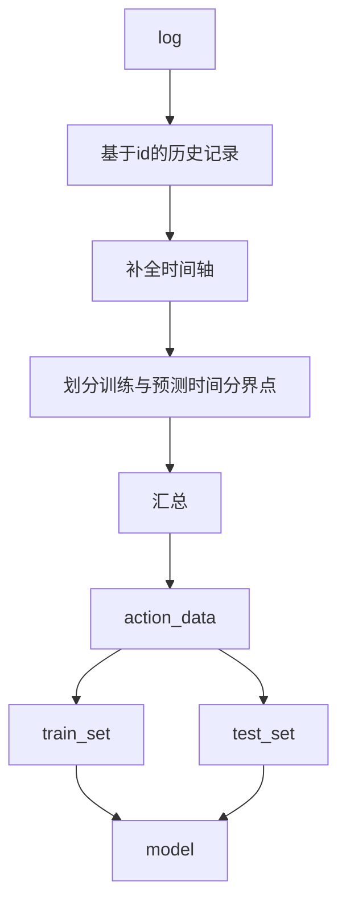

# 20201215
## 怎么对告警序列做词嵌入？
# 20201202
## 时间序列再扫盲 可视化 1%

# 20201201
## IOT项目重启 之前因为亚太数学建模暂停十天
### 更全面的对项目建模
### Restatement and problem

### Asummption
# 20201120
## 对 LSTM结构的进一步理解  
###    example： 
####        训练集 ：10篇文章
####        重复训练集次数： epoch = n_e
####        每次输入模型的词语数量： num_words = n_w
####        每次权重更新消耗的句子数量： batch_sizes = n_b
###    重点： 
#### 1. 每次输入模型的词语数量
    不同的场景下，上下文依赖程度不同，每次输入模型的词语数量要能准确表达句意,num_words 大小的选取是重点，否则每次模型都在 '断章取义'
#### 2. 反向传播
    全连接网络的权值是从最后一层隐含层向前一层的节点传递，但是像LSTM这样的循环神经网络，如果以相同的表述，本节点的上一层节点其实是上一时刻的本节点。

    导致循环神经网络反向传播的细节上和全连接网络不同，被称为backpropagation through time, BPTT。
    link: https://ilewseu.github.io/2017/12/30/RNN%E7%AE%80%E5%8D%95%E6%8E%A8%E5%AF%BC/

# 20201119
## 面向时间序列模型进行预处理
   
    序列网络的训练数据只包含告警序列，不包含设备位置等数据

## Question  CLOSED
    对于RNN LSTM等序列模型有一个问题待解决:

        Q：对于多序列的序列预测 在训练时同一时间上的多个序列是否会相互影响?
            会影响到训练数据的选择是否要保留设备id地理信息等数据
        answer:
            不保留
            对于网络来说，只是对输入的数据进行适应调整自身的权值，LSTM等序列网络是基于序列的历史行为的 区别在于对于历史的记忆强弱和记忆方式 
           
                
        solution： 
            1. 将多维序列输入网络 先试试这个
            2. 对于多维序列进行编码（类似embedding），降维到单变量序列，再对预测出的序列进行解码，还原多变量序列

# 20201115
    12-14日代码丢失 
    现在看来写的也是垃圾丢了就丢了 20201120

## 基于treelib库建立了区域层级的树结构
    预计区域的融合告警会基于树来实现
## 封包了几个基于本数据集的预处理class
    10% 
# 20201111
## log14 50%测试集 逻辑回归 准确率97%
    problem： 原始数据时间轴没有做插值 使得数据集不完备 还需要改进

# 20201110
## 针对数据分布状况 挑选训练特征
### 对数据价值进行界定
    H 高价值数据 63条 
        GPS
        单项告警>10
    M 普通数据 443条
        无GPS
        单项告警>10
    L 低价值数据 2500条左右
        零星告警 
## 对数据有基础了解了 基于M数据进行建模

    

# 20201109
## 完成数据均衡描述
    极度不均衡 3013台设备里 仅500台有告警记录 
    同时带有 告警数据与gps数据的有91台 数据可用（>10条告警）的有63台 不过在地理位置上分布还算均匀
    需要再评估3-1与4-2区域 
## pipeline 有bug要修复 

# 20201108
## 明确建模层级
    基于一设备的所有告警 汇总为一行作为训练数据
    预测目标为 某时间内是否告警0/1
## preprocess 
    sum_action.py 读取 追加 
## pipeline 
    可读性高
    模式
        先策划好事物 在划定具体功能
