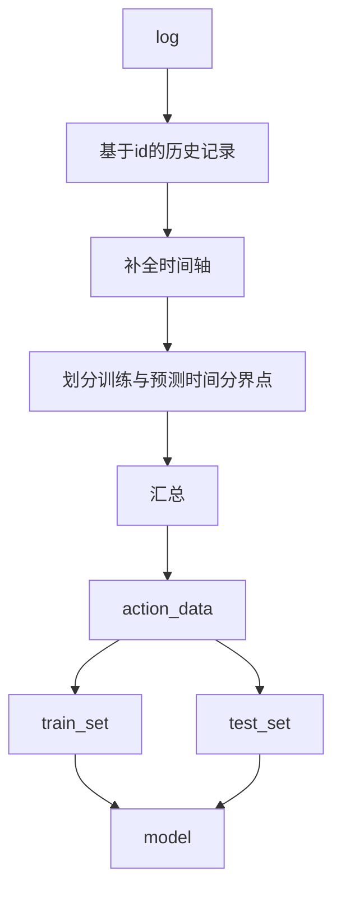

# 20201119
## 区域树初步建立完成 后续完善暂缓
## 面向时间序列模型进行预处理
    插值
## Q&A
    对于RNN LSTM等序列模型有一个问题待解决:

        Q：对于多序列的序列预测 在训练时同一时间上的多个序列是否会相互影响（数据信息共享)?
            答案的是否会影响到训练数据的选择是否要保留设备id地理信息等数据
        answer:
            对于网络来说，只是对输入的数据进行适应调整自身的权值，LSTM等序列网络是基于序列的历史行为的 区别在于对于历史的记忆强弱和记忆方式 
            假设1：
                对于多变量序列模型，网络的权值是对多个变量的共同作用 
                
        solution： 
            1. 基于假设1 ，将多变量序列输入网络
            2. 对于多变量序列进行编码，降维到单变量序列，再对预测出的序列进行解码，还原多变量序列

        

# 20201115
    12-14日代码丢失
## 建立了区域关系的树结构
    预计后续处理都会基于树
## 开始开发基于本数据集的预处理工具
    10%
# 20201111
## log14 50%测试集 逻辑回归 准确率97%
    problem： 原始数据时间轴没有做插值 使得数据集不完备 还需要改进

# 20201110
## 针对数据分布状况 挑选训练特征
### 对数据价值进行界定
    H 高价值数据 63条 
        GPS
        单项告警>10
    M 普通数据 443条
        无GPS
        单项告警>10
    L 低价值数据 2500条左右
        零星告警 
## 对数据有基础了解了 基于M数据进行建模

    

# 20201109
## 完成数据均衡描述
    极度不均衡 3013台设备里 仅500台有告警记录 
    同时带有 告警数据与gps数据的有91台 数据可用（>10条告警）的有63台 不过在地理位置上分布还算均匀
    需要再评估3-1与4-2区域 
## pipeline 有bug要修复 

# 20201108
## 明确建模层级
    基于一设备的所有告警 汇总为一行作为训练数据
    预测目标为 某时间内是否告警0/1
## preprocess 
    sum_action.py 读取 追加 
## pipeline 
    可读性高
    模式
        先策划好事物 在划定具体功能
