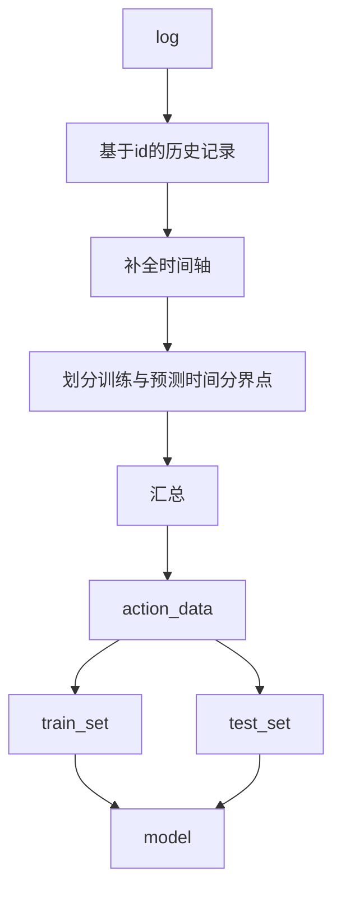

# 20201110
## 针对数据分布状况 挑选训练特征
### 对数据价值进行界定
    H 高价值数据 63条 
        GPS
        单项告警>10
    M 普通数据 443条
        无GPS
        单项告警>10
    L 低价值数据 2500条左右
        零星告警 
## 对数据有基础了解了 基于M数据进行建模

    

# 20201109
## 完成数据均衡描述
    极度不均衡 3013台设备里 仅500台有告警记录 
    同时带有 告警数据与gps数据的有91台 数据可用（>10条告警）的有63台 不过在地理位置上分布还算均匀
    需要再评估3-1与4-2区域 
## pipeline 有bug要修复 

# 20201108
## 明确建模层级
    基于一设备的所有告警 汇总为一行作为训练数据
    预测目标为 某时间内是否告警0/1
## preprocess 
    sum_action.py 读取 追加 
## pipeline 
    可读性高
    模式
        先策划好事物 在划定具体功能
